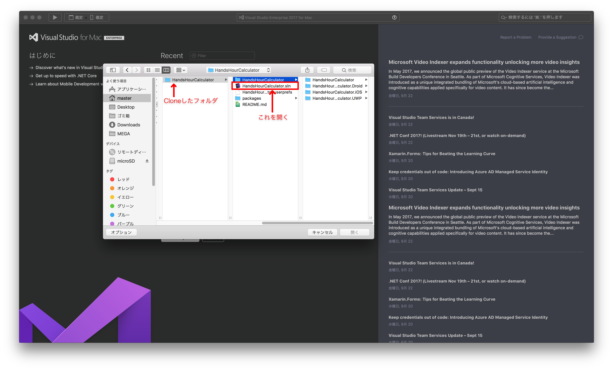
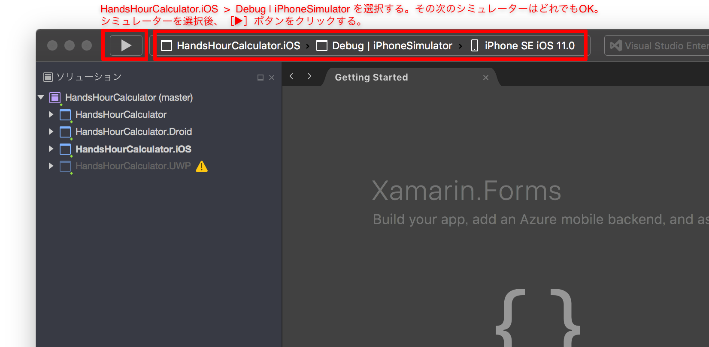
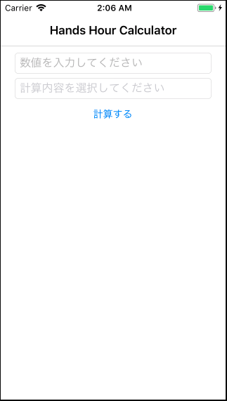
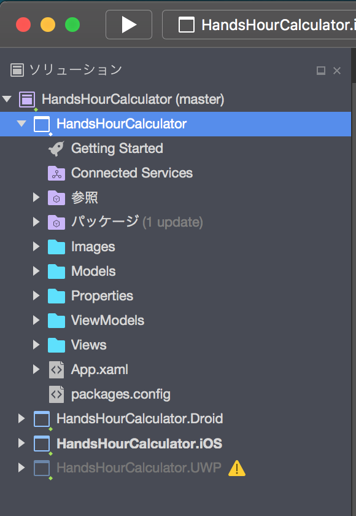

# Hands Hour Calculator

## このアプリは何？

Xamarin.FormsとMVVMのハンズオン用のサンプルアプリです。<br>
MVVM構築用のフレームワークには、Prism.Formsを使用しています。<br>
このREADMEに記載している手順でアプリを実際に修正していただくことで、Xamarin.FormsとMVVMを使った開発を始める取っ掛かりを掴んでいただくことを目的としています。<br>

## こんなことを実践します
- Viewの書き方（Xaml）がどのようなものなのかを知る。
- ViewからViewModelへ情報が渡るようにソースを書き直してみる。
- ViewModelで持っている情報をViewに返して、画面に反映させてみる。
- C#特有な書き方（setterとgetterの書き方、regionディレクティブ、ドキュメントコメント）を知る。

## ハンズオン手順

### 1. ソースをクローンする。

このプロジェクトのソースをローカルにクローンします。

### 2. Visual Studio for Mac で「ソリューション」を開く。

Visual Studio for Macで、クローンしたフォルダ内にある「HandsHourCalculator.sln」を開きます。



#### ◆「ソリューション」とは？

Xamarinに限らず、.NET系の制作物（WPF、ASP.NET、etc...）は、
『「ソリューション」と呼ばれる単位の下に「プロジェクト」と呼ばれる単位がいくつか含まれる』という構成になっています。
Xamarin.Formsのプロジェクトでは、基本的には以下のような構成になっています。


ソリューション<br>
├── ソリューション名**（全プラットフォームの共通部分を持つプロジェクト）** <br>
├── ソリューション名.Droid**（Androidの固有部分を持つプロジェクト）** <br>
├── ソリューション名.iOS**（iOSの固有部分を持つプロジェクト）** <br>
└── ソリューション名.UWP**（UWPの固有部分を持つプロジェクト）** <br>

このハンズオンでは、全プラットフォームの共通部分を持つプロジェクトのみに手を入れます。<br>
プラットフォームごとの固有機能やハードウェア（カメラ、Bluetooth等）を使う機能を作りたい場合は、基本的にはプラットフォームの固有部分を実装する必要があります。ですが、最近ではプラットフォームごとに処理を実装しなくても、公開されているライブラリ（**NuGetパッケージ**）を使うだけで済んだりもします。<br>

### 3. ビルドして起動してみる

ソリューションを開いたら、まずはiOS用にビルドしつつシミュレーターで動くことを確認してみましょう。<br>



#### ◆HandsHourCalculator.UWPだけ警告マークが付いているのはなぜ？

UWP用のプロジェクトは、Windowsでしかビルドすることができません。
そのため、このように警告マークが付いています。


ビルドが完了したら、シミュレーターが起動し、アプリが実行されます。<br>
クローンしてからの初回ビルド時は、パッケージのダウンロードがあるため、時間がかかることがあります。<br>
以下のように殺風景なアプリが立ち上がったら成功です。<br>



サンプルプロジェクトを取得したままの状態では、画面を操作しても反応はありません。<br>
このプロジェクトのソースを実際に書き換えて、動くものを作っていきます。

### 4. 共通プロジェクトの構成を見る

Visual Studio for Mac 上で、共通プロジェクト「HandsHourCalculator」を展開すると、以下の構成になっています。<br>



今回特に重要な部分は、「Views」「ViewModels」「Models」です。<br>
その他の部分は今回触れる予定はありませんが、紹介だけすると、以下のようなものになっています。<br>

- 参照<br>
　⇒ 参照可能なライブラリ（using 〜 で使用できるもの）を指定しています。
- パッケージ<br>
　⇒ 使用するNuGetパッケージ（第三者が作ったライブラリのようなもの）を指定しています。
- Images<br>
　⇒ 共通化して利用する画像リソースを配置するために作ったフォルダです。
- Properties<br>
　⇒ ソリューション作成時に自動生成されます。中のソースでバージョン情報や標準言語等を指定しています。
- App.xaml<br>
　⇒ 画面遷移を実装したりする場合は、これにくっついているApp.xaml.csというファイルを書き換えます。
- packages.config<br>
　⇒ どのNuGetパッケージのどのバージョンを使用するかが書かれているファイルです。

### 5. アプリの画面とViewを見比べる

アプリをシミュレーターで起動しながら、Viewsフォルダ内のMainPage.xamlを開きましょう。<br>
このMainPage.xamlが、アプリの画面を構成しています。<br>
Xamlファイルはマークアップ調で書かれているため、HTMLを触った経験のある方にはいくらかとっつきやすいかもしれません。<br>
それぞれの項目が何であるかについては、MainPage.xamlに書いてあるコメントを参照してください。<br>

### 6. ViewModelを見てみる

MainPage.xamlに対応するViewModelを見てみましょう。ViewModelsフォルダ内のMainPageViewModel.csを開いてください。<br>
後々の工程で、このファイルの中に**Viewとバインドする（＝繋げる）変数の定義**や**Viewから受け取るコマンドと実処理の紐付け**を書いていきます。<br>

先に、このViewModelで使用しているC#特有の記法についていくつか紹介します。<br>

#### C#のsetterとgetter

C#では、以下のようにsetterとgetterを書きます。Javaよりだいぶスリムです。
```C#
private string _imageSourcePath;
public string ImageSourcePath
{
    get { return _imageSourcePath; }
    set { SetProperty(ref _imageSourcePath, value); }
}
```

「_imageSourcePath」が変数の実体です。<br>
普通の変数を扱うような感覚で「ImageSourcePath」への代入や値の取得を行うと、getやsetに書かれている処理が行われます。<br>
set内で実行されている「SetProperty」は、この変数の値の変化をViewへ通知するために必須の処理（※）です。<br>
もしViewへの通知が要らない場合は、単に「_imageSourcePath = value;」と書くだけで大丈夫です。<br>
<br>
※PrismではSetPropertyが使われますが、Prism以外のフレームワークでMVVMを実装する場合は別の処理が使用されます。

#### regionディレクティブ

所々に「#region 〜」「#endregion」と書かれています。<br>
これを使うことで、ソース内で「どのようなものをどこに書いておくか」を整理することができます。<br>
regionで囲われた範囲をたたむこともできるので、開発中にソースが見やすくなります。<br>

#### ドキュメントコメント

以下のようなコメントがいくつかあります。
```C#
/// <summary>
/// 画像リソースのパス
/// </summary>
```
これは「ドキュメントコメント」と呼ばれるもので、外部のソースからこのクラスを使おうとした場合に変数の説明としてここに記載された内容が表示されます。<br>

