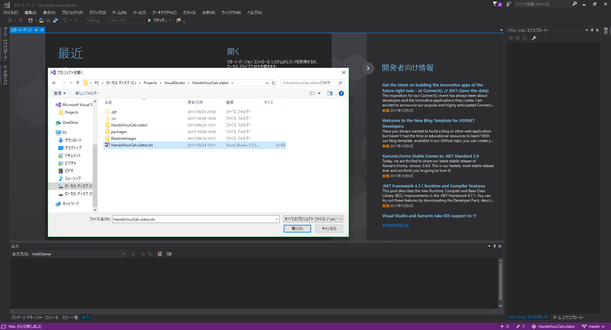
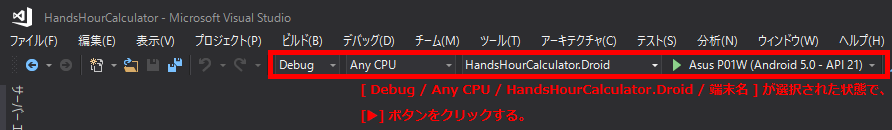
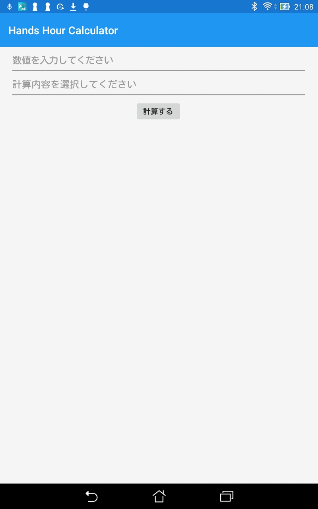
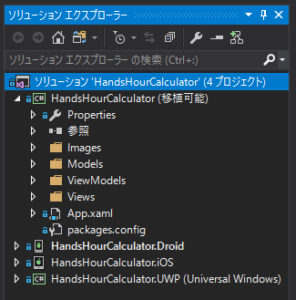

# Hands Hour Calculator

手を動かす時間（Hands hour）です。

## このアプリは何？

Xamarin.FormsとMVVMのハンズオン用のサンプルアプリです。<br>
MVVM構築用のフレームワークには、Prism.Formsを使用しています。<br>
このREADMEに記載している手順でアプリを実際に修正していただくことで、Xamarin.FormsとMVVMを使った開発を始める取っ掛かりを掴んでいただくことを目的としています。<br>

## こんなことを実践します
- Viewの書き方（Xaml）がどのようなものなのかを知る。
- ViewからViewModelへ情報が渡るようにソースを書き直してみる。
- ViewModelで持っている情報をViewに返して、画面に反映させてみる。
- C#特有な書き方（setterとgetterの書き方、regionディレクティブ、ドキュメントコメント）を知る。

## ハンズオン手順

### 1. ソースをクローンする。

このプロジェクトのソースをローカルにクローンします。

### 2. Visual Studio 2017 で「ソリューション」を開く。

Visual Studio 2017 で、クローンしたフォルダ内にある「HandsHourCalculator.sln」を開きます。



#### ◆「ソリューション」とは？

Xamarinに限らず、.NET系の制作物（WPF、ASP.NET、etc...）は、
『「ソリューション」と呼ばれる単位の下に「プロジェクト」と呼ばれる単位がいくつか含まれる』という構成になっています。
Xamarin.Formsのプロジェクトでは、基本的には以下のような構成になっています。


ソリューション<br>
├── ソリューション名 **（全プラットフォームの共通部分を持つプロジェクト）** <br>
├── ソリューション名.Droid **（Androidの固有部分を持つプロジェクト）** <br>
├── ソリューション名.iOS **（iOSの固有部分を持つプロジェクト）** <br>
└── ソリューション名.UWP **（UWPの固有部分を持つプロジェクト）** <br>

このハンズオンでは、全プラットフォームの共通部分を持つプロジェクトのみに手を入れます。<br>
プラットフォームごとの固有機能やハードウェア（カメラ、Bluetooth等）を使う機能を作りたい場合は、基本的にはプラットフォームの固有部分を実装する必要があります。ですが、最近ではプラットフォームごとに処理を実装しなくても、公開されているライブラリ（**NuGetパッケージ**）を使うだけで済んだりもします。<br>

### 3. ビルドして起動してみる

ソリューションを開いたら、まずはiOS用にビルドしつつシミュレーターで動くことを確認してみましょう。<br>



ビルドが完了したら、シミュレーターが起動し、アプリが実行されます。<br>
クローンしてからの初回ビルド時は、パッケージのダウンロードがあるため、時間がかかることがあります。<br>
以下のように殺風景なアプリが立ち上がったら成功です。<br>



サンプルプロジェクトを取得したままの状態では、画面を操作しても反応はありません。<br>
このプロジェクトのソースを実際に書き換えて、動くものを作っていきます。

### 4. 共通プロジェクトの構成を見る

Visual Studio 2017 上で、共通プロジェクト「HandsHourCalculator」を展開すると、以下の構成になっています。<br>



今回特に重要な部分は、「Views」「ViewModels」「Models」です。<br>
その他の部分は今回触れる予定はありませんが、紹介だけすると、以下のようなものになっています。<br>

- 参照<br>
　⇒ 参照可能なライブラリ（using 〜 で使用できるもの）を指定しています。
- Images<br>
　⇒ 共通化して利用する画像リソースを配置するために作ったフォルダです。
- Properties<br>
　⇒ ソリューション作成時に自動生成されます。中のソースでバージョン情報や標準言語等を指定しています。
- App.xaml<br>
　⇒ 画面遷移を実装したりする場合は、これにくっついているApp.xaml.csというファイルを書き換えます。
- packages.config<br>
　⇒ どのNuGetパッケージのどのバージョンを使用するかが書かれているファイルです。

### 5. アプリの画面とViewを見比べる

アプリをシミュレーターで起動しながら、Viewsフォルダ内のMainPage.xamlを開きましょう。<br>
このMainPage.xamlが、アプリの画面を構成しています。<br>
Xamlファイルはマークアップ調で書かれているため、HTMLを触った経験のある方にはいくらかとっつきやすいかもしれません。<br>
それぞれの項目が何であるかについては、MainPage.xamlに書いてあるコメントを参照してください。<br>

### 6. ViewModelを見てみる

MainPage.xamlに対応するViewModelを見てみましょう。ViewModelsフォルダ内のMainPageViewModel.csを開いてください。<br>
後々の工程で、このファイルの中に**Viewとバインドする（＝繋げる）変数の定義**や**Viewから受け取るコマンドと実処理の紐付け**を書いていきます。<br>

先に、このViewModelで使用しているC#特有の記法についていくつか紹介します。<br>

#### C#のsetterとgetter

C#では、以下のようにsetterとgetterを書きます。Javaよりだいぶスリムです。
```C#
private string _imageSourcePath;
public string ImageSourcePath
{
    get { return _imageSourcePath; }
    set { SetProperty(ref _imageSourcePath, value); }
}
```

「_imageSourcePath」が変数の実体です。<br>
普通の変数を扱うような感覚で「ImageSourcePath」への代入や値の取得を行うと、getやsetに書かれている処理が行われます。<br>
set内で実行されている「SetProperty」は、この変数の値の変化をViewへ通知するために必須の処理（※）です。<br>
もしViewへの通知が要らない場合は、単に「_imageSourcePath = value;」と書くだけで大丈夫です。<br>
<br>
※PrismではSetPropertyが使われますが、Prism以外のフレームワークでMVVMを実装する場合は別の処理が使用されます。

#### regionディレクティブ

所々に「#region 〜」「#endregion」と書かれています。<br>
これを使うことで、ソース内で「どのようなものをどこに書いておくか」を整理することができます。<br>
regionで囲われた範囲をたたむこともできるので、開発中にソースが見やすくなります。<br>

#### ドキュメントコメント

以下のようなコメントがいくつかあります。
```C#
/// <summary>
/// 画像リソースのパス
/// </summary>
```
これは「ドキュメントコメント」と呼ばれるもので、外部のソースからこのクラスを使おうとした場合に変数の説明としてここに記載された内容が表示されます。<br>

### 7. ViewとViewModelの変数をバインドしてみよう

ユーザーがアプリへ入力した内容を、ViewModelのプロパティにリアルタイムで取得できるようにします。<br>
まずば、ViewModel側にプロパティを作成していきます。<br>

**例）_inputString の下に InputString を作成する。**

**・追加前**
```C#
/// <summary>
/// ユーザーが入力した文字列
/// </summary>
private string _inputText;
```
**・追加後**
```C#
/// <summary>
/// ユーザーが入力した文字列
/// </summary>
private string _inputText;
public string InputText
{
    get { return _inputText; }
    set { SetProperty(ref _inputText, value); }
}
```

同じ要領で、<br>
　**_calcMethodIndex の下に CalcMethodIndex**<br>
　**_calculationResult の下に CalculationResult**<br>
を作成しましょう。<br>

次に、View側に「このコントロールのプロパティはViewModelのこれにバインドします」という記述を追加していきます。<br>

**例）Entryコントロールへの入力値（プロパティ名：Text）を、ViewModelの「InputText」にバインドする。**

**・追加前**
```XML
<Entry Grid.Row="0" Margin="10,0,10,0"
       HorizontalOptions="FillAndExpand" VerticalOptions="Center"
       Keyboard="Numeric" Placeholder="数値を入力してください"/>
```
**・追加後**
```XML
<Entry Grid.Row="0" Margin="10,0,10,0"
       HorizontalOptions="FillAndExpand" VerticalOptions="Center"
       Keyboard="Numeric" Placeholder="数値を入力してください"
       Text="{Binding InputText}"/>
```

同じ要領で、<br>
　**「Pickerコントロールの選択値（プロパティ名：SelectedIndex）にCalcMethodIndex」**<br>
　**「Imageコントロールのソース（プロパティ名：Source）にImageSourcePath」**<br>
　**「Labelコントロールの文字列（プロパティ名：Text）にCalculationResult」**<br>
をそれぞれバインドしましょう。<br>

ここまでを行った段階でViewModelのプロパティのsetterにブレークポイントを置いてデバッグ実行すると、コントロールに値を入力したときにViewModelのsetterが呼び出されることを確認することができます。<br>

### 8. Viewのボタンの処理をViewModelの処理にバインドしてみよう

Viewに配置されている「計算する」ボタンがタップされたときに、ViewModelの処理「calculate」が実行されるようにします。<br>
ざっくり手順を書くと、以下の通りです。<br>
1. ViewModelに「コマンド」を用意する
1. 用意したコマンドと実処理を紐付ける
1. Viewに配置してあるボタンのコマンドとViewModelのコマンドをバインドする

#### 8.1. ViewModelに「コマンド」を用意する

サンプルプロジェクトではすでに以下のコマンドが用意してあるので、この手順は飛ばします。<br>
```C#
// 計算ボタンのコマンド
public ICommand CalculateCommand { get; }
```

#### 8.2. 用意したコマンドと実処理を紐付ける

コマンド「CalculateCommand」と、すでに用意してある実処理「calculate」を紐付けます。<br>
MainPageViewModelのコンストラクタ（public MainPageViewModel）に、以下のような記述を追加してください。<br>

**・追加前**
```C#
/// <summary>
/// コンストラクタ
/// </summary>
public MainPageViewModel(IPageDialogService pageDialogService)
{
    // ダイアログ表示処理を扱うサービスの実体をフィールドに保持する。
    _pageDialogService = pageDialogService;
}
```

**・追加後**
```C#
/// <summary>
/// コンストラクタ
/// </summary>
public MainPageViewModel(IPageDialogService pageDialogService)
{
    // 計算ボタンのコマンドに、計算の実処理を紐付ける。
    CalculateCommand = new DelegateCommand(calculate);

    // ダイアログ表示処理を扱うサービスの実体をフィールドに保持する。
    _pageDialogService = pageDialogService;
}
```

#### 8.3. Viewに配置してあるボタンのコマンドとViewModelのコマンドをバインドする

MainPage.xamlのButtonに、以下のようにCommandのバインドを追加します。<br>

**・追加前**
```XML
<Button Grid.Row="2"
        HorizontalOptions="Center" VerticalOptions="Center"
        Text="計算する"/>
```

**・追加後**
```XML
<Button Grid.Row="2"
        HorizontalOptions="Center" VerticalOptions="Center"
        Text="計算する"
        Command="{Binding CalculateCommand}"/>
```

### 9. 計算結果がViewへ反映されるようにする

ここまでの手順で、Viewに対するユーザーが行った入力等の操作がViewModelに通知されるようになりました。<br>
逆に「ViewModelで行った値の変更をViewに反映させる」ための手順はとても簡単で、Viewにバインドされているプロパティに値を代入するだけでOKです。<br>
計算結果がViewに反映されるよう、MainPageViewModelの処理「calculate」の最後の部分を以下のように修正しましょう。<br>

**・修正前**
```C#
switch (_calcMethodIndex)
{
    // Viewとバインドされているプロパティ（ここではCalculationResultとImageSourcePath）を更新すると、
    // その変更がViewに反映される。

    case INDEX_DOUBLE:
        ImageSourcePath = IMAGE_DOUBLE;
        break;
    case INDEX_TEN_TIMES:
        ImageSourcePath = IMAGE_TEN_TIMES;
        break;
    case INDEX_ONE_HUNDRED_TIMES:
        ImageSourcePath = IMAGE_ONE_HUNDRED_TIMES;
        break;
    default:
        return;
}
```

**・修正後**
```C#
switch (_calcMethodIndex)
{
    // Viewとバインドされているプロパティ（ここではCalculationResultとImageSourcePath）を更新すると、
    // その変更がViewに反映される。

    case INDEX_DOUBLE:
        CalculationResult = calculator.ToDoubleNumber(targetNum);
        ImageSourcePath = IMAGE_DOUBLE;
        break;
    case INDEX_TEN_TIMES:
        CalculationResult = calculator.ToTenTimes(targetNum);
        ImageSourcePath = IMAGE_TEN_TIMES;
        break;
    case INDEX_ONE_HUNDRED_TIMES:
        CalculationResult = calculator.ToOneHundredTimes(targetNum);
        ImageSourcePath = IMAGE_ONE_HUNDRED_TIMES;
        break;
    default:
        return;
}
```

これでサンプルアプリの修正は完了です。<br>

### 10. アプリを動かしてみよう

ここまでの手順が完了したら、入力から計算結果の画面への反映まで、一連の動作が行われるような状態になっています。<br>
アプリを再度動かしてみましょう。<br>

### 【おまけ】 いまどこアプリに「なりすまし」をかましてみよう

[iOS/Android/WindowsPhoneの全端末に対応したiBeacon発信アプリ](https://github.com/microwavePC/iBeaconTransmitter)があるので、時間が余ったらクローンして実機で動かしてみましょう。<br>
GPS未対応版であれば、自分が居る場所を偽装できるかもしれません。<br>
